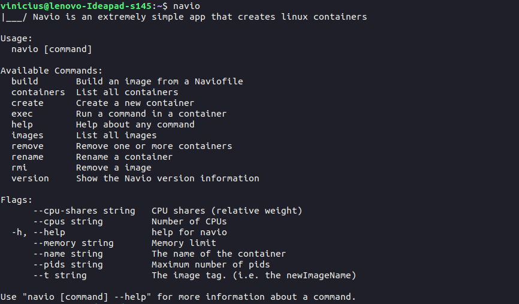
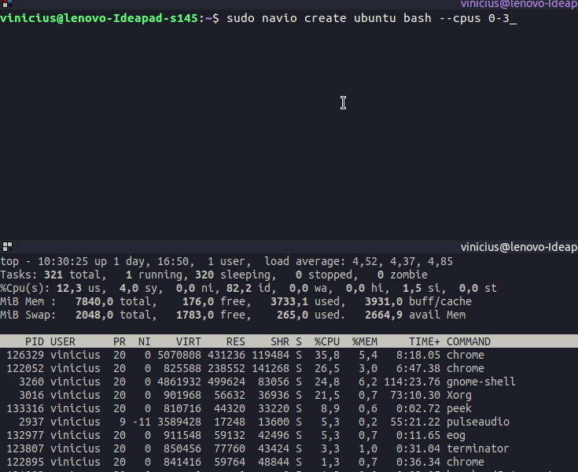

# Navio

   


**Navio** is a simple tool for creating and managing linux containers.

A container is **a set of processes isolated by Linux namespaces**. We use, for example, **PID** namespace to isolate the PID number space, **UTS** to isolate the hostname and **MOUNT** to isolate the filesystem mount points.

All containers have their own **rootfs** (a isolated "mini operating system") associated, so that a change (for example, an installation of any library or a creation of a file) in a container does not affect others ones.

It is also possible use `Cgroups` to limit the amount of resources that each container can use.

### Why?
For study purposes only. If you want to use real containers use [Docker](https://www.docker.com/) or [Containerd](https://containerd.io/).

## Available Default Images


| Image| version| size |
| ---- | -----| ------|
| alpine|  v3.11| 2.7M|
| busybox| v4.0| 1.5M|
| ubuntu| v20.04| 90M|


These are the default images, but you can easily create your own images with the packages and files you find necessary. For example, with the following Naviofile:

``` Dockerfile
FROM ubuntu    

ADD . /mydir

RUN apt update && apt upgrade -y && apt install python -y
```

``` bash 

cd /path/to/Naviofile
sudo navio build . --t python-image
```

we created an image with python installed, so the containers that use this image will already have python installed by default, as well the files from the current directory that will be copied to the `/mydir` directory in the container.


## Demo


## [Namespaces](https://en.wikipedia.org/wiki/Linux_namespaces)

what the processes can see

- [x] UTS - isolate **hostname and domainname**

- [x] PID - isolate the **PID number space**

- [x] MNT - isolate **filesystem mount points**

## [Cgroups](https://www.kernel.org/doc/Documentation/cgroup-v1/cgroups.txt)

what the processes can use

- [x] Memory

- [x] CPU

- [x] Process numbers


## Available Commands 




## How to use

To create a basic container just type:

`sudo navio create ubuntu bash`

But you can use some flags, ex:

`--name ubuone` to define the name of container

`--pids 25`  to limit the maximum number of processes that the container can create

`--cpus 0-3` to limit the cpu cores that the container can use. For example, in this case (0-3) if you computer have at least 4 cores, **this flag will permit that the process of container use only 4 cores, no more**

`--cpus-share 100`

`--memory 1G`  to limit the maximum memory **RAM** that the container can use

### Limiting the container to use only 4 cpu cores




### Building new Images

 To build a image you need first create a [Naviofile](./Naviofile) with the base image and the commands.
 


## Limitations

- The network is not being isolated and is only working on the **ubuntu** image.
- The Navio does not allow containers to run in the background.
- The Navio does not limit the use of I/O

## Requirements

- **linux.** Navio's doesn't support other operational system :(
- [golang environment](https://golang.org/)
- make
- wget
- **mysql** configured with the root password == `root`
- some of commands (ex.: `navio build`, `navio create`, `navio rmi` and `navio exec`) must be executed with sudo privilegies.

## How to install

#### If you just want use, is very simples

``` bash
 git clone https://github.com/viniciusbds/navio.git
 cd navio
 ./install.sh
```

#### If you want compile the code before install

``` bash
 git clone https://github.com/viniciusbds/navio.git
 cd navio
 make
 ./install.sh
```

#### To run all unit tests, type

``` bash
 cd /path/to/project/navio
 sudo make unit-tests
```

#### To uninstall

``` bash
 cd navio
 ./uninstall.sh
```
  
## Example Commands

`navio images`

`sudo navio create ubuntu bash --name mycontainer`

`navio containers`

```
ID	   NAME	   	   IMAGE  	COMMAND  	STATUS

14806622   mycontainer     ubuntu  	bash  		Stopped

```

`sudo navio exec 14806622 bash` 

...

`sudo navio create busybox sh`

`sudo navio create alpine /bin/sh --name levezin`

## Contributing

You can contribute to the project in any way you want, either by fixing bugs, implementing new features, improving the documentation or proposing new features through issues

See [Contributting](/CONTRIBUTING.md) for more details

## References

- [Containers from Scratch • Liz Rice](https://www.youtube.com/watch?v=8fi7uSYlOdc)
  
- [Containers from Scratch](https://ericchiang.github.io/post/containers-from-scratch/)
  
- [Building a container with less than 100 lines in Go](https://www.infoq.com/br/articles/build-a-container-golang/)

- [Linux Namespaces](https://medium.com/@teddyking/namespaces-in-go-basics-e3f0fc1ff69a)
  
- [Namespaces](https://escotilhalivre.wordpress.com/2015/08/12/namespaces/)

- [Understanding Containerization By Recreating Docker](https://itnext.io/linux-container-from-scratch-339c3ba0411d)

- [Doqueru kun](https://github.com/joseims/doqueru-kun)
  
- [Icon](./cargueiro.png) made by [Freepik](https://www.flaticon.com/br/autores/freepik) from [www.flaticon.com](https://www.flaticon.com/br/)
